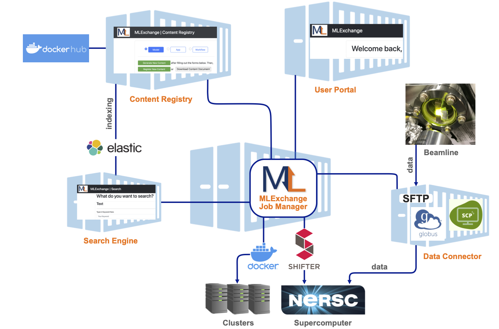

Introduction to MLExchange
==========================

MLExchange is an open source platform that deploys machine learning (ML)
models for beamline scientific data analysis. This platform aims to encourage
collaboration across user facilities, i.e., Argonne National Laboratory
(ANL), Brookhaven National Laboratory (BNL), Lawrence Berkeley National
Laboratory (LBNL), Oak Ridge National Laboratory (ORNL), and SLAC
National Accelerator Laboratory (SLAC).

   MLExchange architecture
   
MLExchange is designed to work as an ecosystem, with applications
accessing services, databases, repositories, and others. The workflow of
MLExchange can be further explained by tracing the submission and
deployment of a ML model within its ecosystem, as follows.

A new ML model can be easily added to the current MLExchange platform
through the **model registry**. Once the model is ingested into the
MLExchange registry, applications in the platform can deploy this
new ML model among different datasets through the **computing
service**. The computing service will deploy the requested model with
its corresponding dataset in a suitable location that can provide the
resources that the algorithm requires for its correct operation.
Simultaneously, the user can access the status of these processes, its
logs, and their final results from the web applications.

Future work
-----------

-  Model recommendation and ranking
-  Data services
